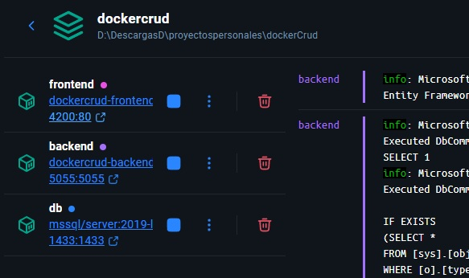
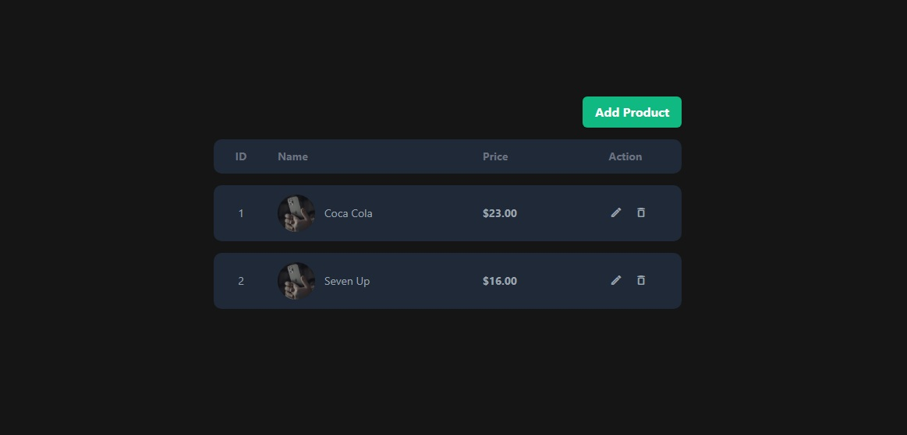

# Fullstack CRUD con Angular 18 + ASP.NET + SQL Server integrando Docker

Este proyecto demuestra un sistema CRUD completo empaquetado con Docker usando un monorepo.

Proyecto realizado:

- Frontend Angular 18
- Backend ASP.NET Core 6 con Entity Framework
- SQL Server 2019
- Orquestado con Docker Compose

Cree los respectivos DockerFile tanto para el backend y frontend para asi construir imagenes personalizadas y asi ejecutar la solucion en los contenedores. Garantizando el despliegue y ejecucion en cualquier entorno compatible con DOcker.

